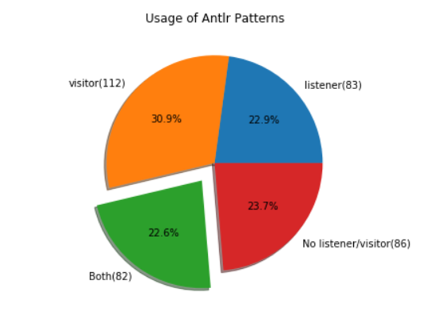
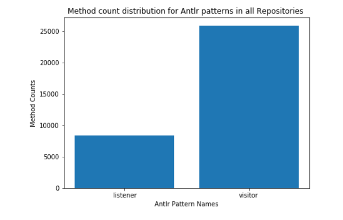
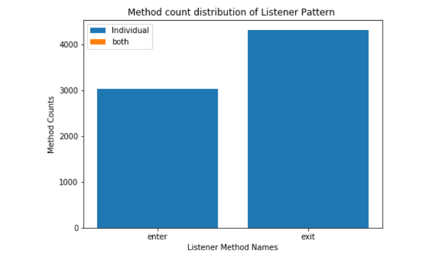

# MSR-2
Mining Software Repositories project to analyze java antlr4 projects and extract information regarding pattern popularity and enter, exit and visit method distributions.

# Grammar Used
Java grammar used in this project is taken from https://github.com/antlr/grammars-v4/tree/master/java. 

# Project Setup on Linux Distributions:

Tools needed : VScode, Jupyter Notebook, text editor, Python3+ must be installed on the system.

1) Install Antlr4 using below commands.

  ```
  a) cd /usr/local/lib
  b) sudo curl -O https://www.antlr.org/download/antlr-4.7.2-complete.jar
  c)  vi /home/praveen/.bashrc and add  belowcommands at the end.
      export CLASSPATH=".:/usr/local/lib/antlr-4.7.2-complete.jar:$CLASSPATH"
      alias antlr4='java -jar /usr/local/lib/antlr-4.7.2-complete.jar'
      alias grun='java org.antlr.v4.gui.TestRig'

  d) source /home/praveen/.bashrc
  e) pip install antlr4-python3-runtime
  ```

2) Download this github repository and open with vscode and install any extensions if needed.
  ```
   wget https://github.com/praveengadiyaram369/MSR-2.git
   or 
   git clone https://github.com/praveengadiyaram369/MSR-2
   ```
   
2) Generate Lexer and parsers for Python Runtime from antlr4 using below commands
   ```
    antlr4 -Dlanguage=Python3 Javalexer.g4
    antlr4 -Dlanguage=Python3 JavaParser.g4
    ```
    
4) copy repository_mining_data.csv, clone_repositories.sh to a folder and execute script as below to download all repositories.
  ```
    sh clone_repositories.sh >> clone_repo_log.log
   ```
    
5) Clear the contents of repo_names_done.txt file.

6) Use below command to execute the python script and mine all the repositories and the mining results to a repository_mining_data.csv. Logs would be automatically written into analysing_repositories_antlr4.log and using & script runs in background.
  ```
   python3 AntlrPatternParser.py __absolute_path_repositories_folder__ & 
  ```
  
7) Script can be re-executed at any time, it will always continue to process from the repository which was left last time.
  Inorder to restart the complete process of mining, follow step 5 and reexecute.

7) Visualize and Validate the results by executing Analyzing_repos.ipynb on jupyter-notebook.

# Project Results:

1) Mining Data Table


2) Antlr4 Pattern Usage


3) Patterns Method count distribution


4) Listener Pattern Method count distribution

